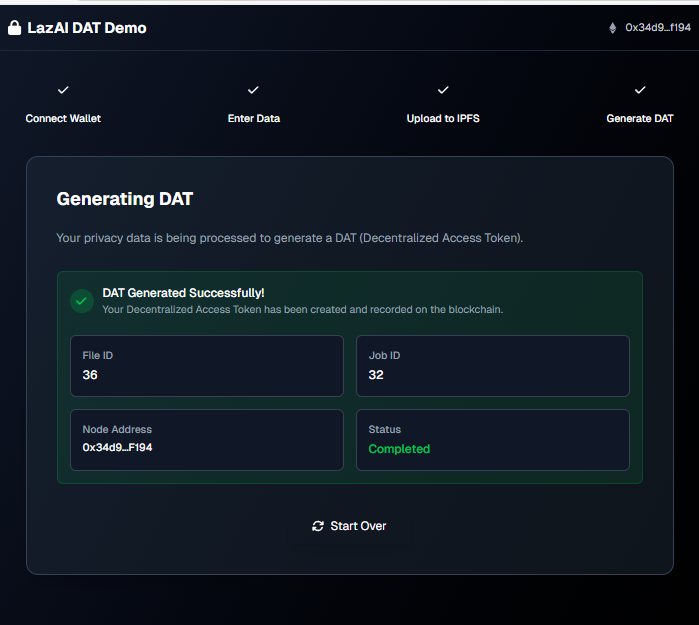

# DAT Application UI

This application used to input the privacy data and upload it to the IPFS and mint DAT from LazAI.

<p align="center">
    
</p>

## Getting Started

```shell
# Install the dependencies
pnpm i

# Copy .env.example to .env
cp .env.example .env

# Run the development server
pnpm dev
```
